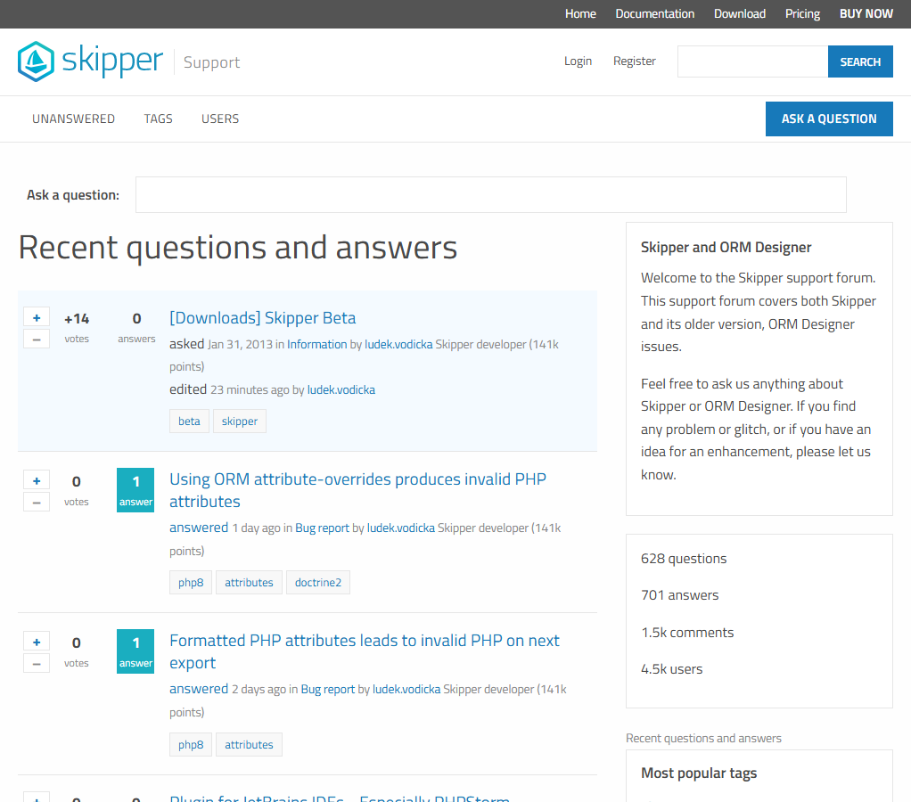

# Question2Answer fork

This repository starts from the official Question2Answer 1.8.8 release and provides a PHP 8.3 Apache container. It is maintained independently at `ludekvodicka/Q2A`.

See [the runtime architecture](docs/architecture/php83-runtime.md) for source provenance, database configuration, build instructions and maintenance responsibilities. Site-specific Skipper themes, plugins, credentials and data live in the deployment repository.

## Skipper theme preview

A live deployment of this fork with the custom Skipper theme, showing the public [Skipper support site](https://www.skipper18.com/support/).

Screenshot captured on 2026-09-10. This is an example of a site built on the fork. The Skipper theme is maintained in the deployment repository; this public repository includes the standard Q2A themes listed below.

## What we changed

The fork retains Question2Answer 1.8.8 and its database schema 67. Its changes focus on the runtime, deployment and mail transport:

| Area | Changes in this repository |
|---|---|
| PHP and operating system | Added a Docker image based on PHP 8.3, Apache and Debian 12, with a digest-pinned base and Debian updates installed during builds. Includes MySQLi/mysqlnd, GD, mbstring and ZIP. |
| Modern MySQL authentication | The container connects to MySQL 9 using `caching_sha2_password`, without requiring the removed `mysql_native_password` plugin. |
| Email | Updated the active PHPMailer library from 6.6.3 to 6.12.0 and removed the SMTP certificate-verification bypass. Certificate and hostname verification are enabled. |
| Runtime configuration | Added database configuration through environment variables or a mounted password file. Missing configuration fails explicitly; credentials are not baked into the image. |
| HTTP and PHP configuration | Disabled Apache version signatures and PHP version headers, blocked direct HTTP access to configuration and dependency directories, disabled PHP execution in upload directories, and explicitly disabled remote PHP includes. |
| Uploads and cache | Moved the cache outside the web root and assigned uploaded temporary files a dedicated directory accessible only to the application user. |
| Operations | Added an HTTP health check, container error logging, disabled browser error output, and support for HTTPS detection behind a reverse proxy. |
| Maintenance | Recorded upstream release provenance, its SHA-256 checksum, the container configuration contract, and SMTP verification results in `docs/architecture/`. |

`allow_url_fopen` remains enabled for remote data retrieval used by Q2A and plugins. It is separate from `allow_url_include`, which is disabled. Applications still need to validate remote URLs; these settings do not replace application security review.

See [runtime configuration](docs/architecture/php83-runtime.md) and [SMTP transport](docs/architecture/smtp-transport.md) for implementation details and validation. This is an independently maintained fork; future Q2A and dependency security updates are the maintainer's responsibility.

## Changes in the Skipper deployment

The support site built on this fork also moved from PHP 5.6/MySQL 5.7 to PHP 8.3/MySQL 9. Its separate deployment repository contains:

- PHP 8 compatibility fixes for retained plugins and removal of unused plugins, reducing the shipped plugin set from 31 to 11.
- An updated S3 upload integration using AWS SDK for PHP 3 and Composer-locked dependencies.
- A custom responsive Skipper theme, including its navigation, branding and server-rendered footer.
- A registration flow in which users confirm their email, submit their first question, answer or comment immediately, and wait for post moderation. Prior account approval is not required to submit.
- A staging environment using a copy of the database, a separate upload prefix and captured test email, with migration checks and a documented rollback procedure.

These are deployment-specific changes, not themes or plugins bundled in this public fork. Database dumps, private data and credentials are not included.

## Theme compatibility

**The standard Question2Answer 1.8.8 theme interface is unchanged.** This repository includes the original **Candy, Classic, Snow and SnowFlat** themes. Their source files and the base theme renderer are unchanged from the official 1.8.8 release.

Themes use Q2A's normal `qa-theme/<theme-name>/` structure. Custom PHP themes can extend `qa_html_theme_base`. A third-party theme must support both **Q2A 1.8.8** and **PHP 8.3**. An older theme may require PHP compatibility fixes even though the fork has not changed the theme interface; compatibility with every third-party theme has not been tested.

### How the Skipper theme is installed

The Skipper deployment builds its site image on top of the public core image. During that build, it copies its custom theme files into `qa-theme/SnowFlat`, replacing the stock SnowFlat files at the same paths. The site's selected theme remains `SnowFlat`, so Q2A loads the Skipper implementation from that directory.

The custom theme extends the standard `qa_html_theme_base`. It provides the Skipper header, navigation, typography, styles and footer, while Q2A's base renderer handles questions, answers, comments and forms. Its footer is rendered by the theme's PHP `footer()` method. It is not injected by JavaScript or fetched from the marketing site on each request.

**The stock SnowFlat theme does not need a compatibility repair for this arrangement.** The shared folder name is a deployment choice, not a change to Q2A's theme format. Changing the Skipper theme requires rebuilding and redeploying the site image; it does not require modifying the public fork's stock SnowFlat theme.

## Upstream project

[Question2Answer][Q2A] (Q2A) is a popular free open source Q&A platform for PHP/MySQL, used by over 20,898 [sites] in 40 languages.

This fork is seeded from the official release ZIP. Upstream's master branch is not the deployment source.

Q2A is highly customisable with many awesome features:

- Asking and answering questions (duh!)
- Voting, comments, best answer selection, follow-on and closed questions.
- Complete user management including points-based reputation management.
- Create experts, editors, moderators and admins.
- Fast integrated search engine, plus checking for similar questions when asking.
- Categories (up to 4 levels deep) and/or tagging.
- Easy styling with CSS themes.
- Supports translation into any language.
- Custom sidebar, widgets, pages and links.
- SEO features such as neat URLs, microformats and XML Sitemaps.
- RSS, email notifications and personal news feeds.
- User avatars (or Gravatar) and custom fields.
- Private messages and public wall posts.
- Log in via Facebook or others (using plugins).
- Out-of-the-box WordPress 3+ integration.
- Out-of-the-box Joomla! 3.0+ integration (in conjunction with a Joomla! extension).
- Custom single sign-on support for other sites.
- PHP/MySQL scalable to millions of users and posts.
- Includes escaping and CSRF protections; ongoing security review is the fork maintainer's responsibility.
- Beat spam with captchas, rate-limiting, moderation and/or flagging.
- Block users, IP addresses, and censor words

Q2A also features an extensive plugin system:

- Modify the HTML output for a page with *layers*.
- Add custom pages to a Q2A site with *page modules*.
- Add extra content in various places with *widget modules*.
- Allow login via an external identity provider such as Facebook with *login modules*.
- Integrate WYSIWYG or other text editors with *editor/viewer modules*.
- Do something when certain actions take place with *event modules*.
- Validate and/or modify many types of user input with *filter modules*.
- Implement a custom search engine with *search modules*.
- Add extra spam protection with *captcha modules*.
- Extend many core Q2A functions using *function overrides*.

----------

All development is now taking place through GitHub. The collaborative development process is being managed by [Scott Vivian][1]. (Note that official releases are still distributed via the [Q2A website][Q2A].) See also:

- The [Q2A docs][2] for how to get started installing and using Q2A.
- The [Changelog][3] for what's new in each version.
- The [contributing file][4] for more information on how to get involved.

Thanks and enjoy!

Gideon & Scott

[Q2A]: http://www.question2answer.org/
[1]: http://www.question2answer.org/qa/user/Scott
[2]: https://docs.question2answer.org/
[3]: https://docs.question2answer.org/install/versions/
[4]: https://github.com/q2a/question2answer/blob/master/CONTRIBUTING.md
[releases]: https://github.com/q2a/question2answer/releases
[sites]: http://www.question2answer.org/sites.php
